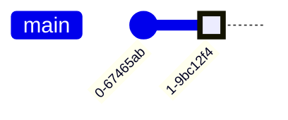

# Git Playground

This project was created to allow playing around with git.
The most common git commands are tested here with the intention to intensify knowledge and to create a very good [cheat sheet](./git_cheat_sheet.md) with the essentials.
[Markdown language](https://www.markdownguide.org/basic-syntax/) was chosen as an easy way of formatting - preventing the usage of binary file formats such as docx (Word), etc. => The usage of git is not funny when it comes to binary files as comparing/merging different maturity steps of a file is not possible!

## Prerequisites

- install git
- install Git Extensions
- install Visual Studio Code
- GitHub account (or any other git website provider accounts like GitLab or bitbucket)

## Getting Started

In order to have a remote repository, a public project on GitHub was created.
The files *Readme.md* and *.gitignore* can be created by the assistant or added later on.
Adding a license is not necessary.
Then the project was cloned to a local computer inside VS-Code.

(If working with a local repository only - without a remote repository - it would be sufficient to create a new directory and to execute `git init` on the command line inside the new directory.)

## Daily Work

A project like this develops over days, weeks, months or years - like most other projects.
Files are added, changed or removed. The folder structure evolves.
It turned out that collecting the steps in [Test Cases](TestCases.md) is a good solution to track the efforts and to get an overview of the work done so far.

## Graphical Elements

A plugin or VS-Code Extension is required for translation of the [Mermaid](https://mermaid.js.org/) script into pictures.
If You see the chart below, it's working on Your computer.

## Links
- https://www.markdownguide.org/basic-syntax/
- https://mermaid.js.org/
