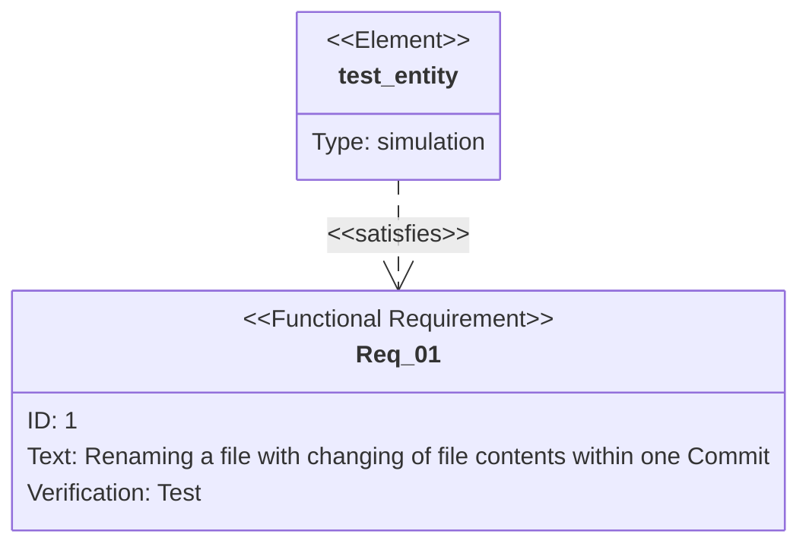
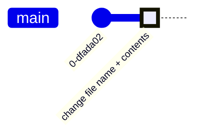

# Test Cases

## Test 1

```mermaid

    requirementDiagram

    functionalRequirement Req_01 {
        id: 1
        text: Renaming a file with changing of file contents within one Commit
        verifymethod: test
    }

    element test_entity {
        type: simulation
    }

    test_entity - satisfies -> Req_01
```

**Renaming + Change of Contents**

```mermaid

    gitGraph
        commit
        commit id: "change file name + contents" type: HIGHLIGHT
```

<ins>Test Result:</ins>

- [x] Test passed
- [ ] Test failed
