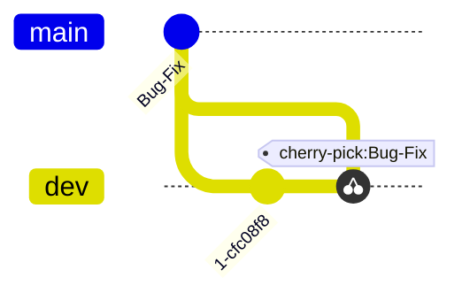

# Test Cases

## Test 1

**Renaming + Change of Contents**

<ins>Test Result:</ins>

- [x] Test passed
- [ ] Test failed

## Test 2

**Renaming on one Branch + Change of Contents on other Branch**

<ins>Test Result:</ins>

- [x] Test passed
- [ ] Test failed

## Test 3

**Cherry-Picking a Commit from another Branch**

<ins>Test Result:</ins>

- [x] Test passed
- [ ] Test failed

## Test 5

**Merge Commit from another Branch**

<ins>Test Result:</ins>

- [x] Test passed
- [ ] Test failed

## Test 10

**Normal Rebase**

History before `rebase`:

        
History after `rebase`:

<ins>Test Result:</ins>

- [x] Test passed
- [ ] Test failed

## Test 11

**Using reflog to recover from hard reset**

Review commit graph and go back to a point of time some commits before (5 commits). 
Execute command `git reset --hard HEAD~5`. 
Analyse reflog (`git reflog show HEAD`). Do a new `git reset --hard <reference>` (reference is either a commit hash or a tag like HEAD@{n}) targetting at the commit before the first `git reset --hard ...`. 
The commit graph shall look the same as before the manipulations!
