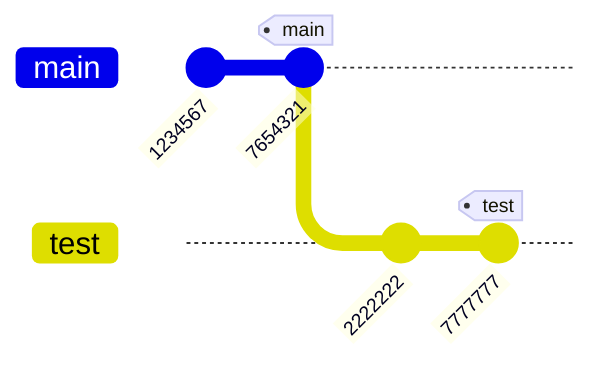
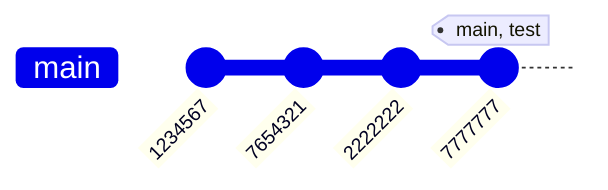

# git Cheat Sheet

## Profile Settings
### Check:
```
git config user.name
git config user.email
git config --global --list // gives a good overview
```

### Change:
```
git config --global user.name "user"
git config --global user.email "email"
```

## Create Local Repository
```
git init
```

## Information
```
git version
git status
git log  // show history of all commits
git log --oneline
git diff // shows differences compared to last commit
```

## Exclude Files/Folders from git
add to .gitignore <br />
or
```
git update-index --assume-unchanged Asap2Toolset/MCDrms.dll // This will suppress changes for the specified file
                                                               until this is reverted by --no-assume-unchanged.
```

## Staging
```
git add <file>
git add . // Stage all changes
```

### Unstage
```
git restore --staged <file>    // Unstage a file
git restore --staged .         // Unstage all staged files
git reset                      // Unstage all staged files (should be executed in repo root)
git reset HEAD <file>          // Unstage a file
git reset HEAD <directoryName> // Unstage all files in directory
```
Your modifications will be kept. When you run git status the file will once again show up as modified but not yet staged.

## Stashing
```
git stash                     // Stash your changes
git stash push -m "message"   // Stash with a message
git stash list                // List all stashes
git stash branch <branchname> // Create a branch from a stash
git stash pop [--index]       // fetch last stash and continue work
```

Untracked files (new files not yet added to Git) are not stashed by default.
To stash untracked files too, use ...
```
git stash -u // or --include-untracked
```

## Branches
```
git branch                              // show list of all local branches
git branch -a                           // show list of all local and remote branches
git branch <branch-name>                // creates a new branch - doesn't switch to it!
git switch -c <branch-name>             // create a branch and switch to it
git switch <branch-name>                // switch to branch
git pull                                // copy changes from remote branch to local repository
git push                                // copy local changes to remote branch
git push -u origin main[/master]        // copy local changes to remote branch - explicit form
git branch -m master main               // Rename master to main
git branch -m <new branch name>         // Rename the currently active branch
git checkout -b <branch-name>           // create a branch and switch to it
git checkout <branch-name>              // switch to branch
git checkout .                          // write content from index, i.e undo unstaged local modifications
git checkout [some_dir/file.txt]        // yet another way to revert all uncommitted changes (longer to type, but works from any subdirectory)
git remote -v                           // inspect what's on remote branch
git remote add origin https://[url.git] // copy local repository to remote branch
git remote rename <old> <new>           // rename remote branch
git branch -d <branch_name>             // only deletes branch if it has already been fully merged in its upstream branch
git branch -D <branch_name>             // force deleting local branch
git push origin --delete <branch_name>  // delete remote branch
git remote remove <name>                // delete remote branch
```

## Commit
### Conventions
https://cbea.ms/git-commit/

1. Separate subject from body with a blank line
2. Limit the subject line to 50 characters
3. Capitalize the subject line
4. Do not end the subject line with a period
5. Use the imperative mood in the subject line
6. Wrap the body at 72 characters
7. Use the body to explain what and why vs. how

```
git commit -m "message"    // move files from staging area into repository
git commit -a -m "message" // add all unstaged changes and commit
git commit --amend         // correct last commit: add files or correct wording
```

## Merge
No branch shall contain uncommitted changes before doing a merge!
Only branches are merged - no single commits.<br />
**The merge always targets the current HEAD branch!**

```
git merge [-n] [--stat] [--no-commit] [--squash] [--[no-]edit]
          [--no-verify] [-s <strategy>] [-X <strategy-option>] [-S[<keyid>]]
          [--[no-]allow-unrelated-histories]
          [--[no-]rerere-autoupdate] [-m <msg>] [-F <file>]
          [--into-name <branch>] [<commit>…​]
git merge (--continue | --abort | --quit)
git merge <source_branch> // most common usage: checkout target branch and enter this command
```

### Fast-Forward Merge
This is the simplest merge! This example shows the merge of `test` into `main`.<br />
```
git checkout main // switch to recipient branch
git merge test
```

No changes on `main` since branching to `test`! No automatic commit is created by git.<br />
**Only the pointer for branch `main` is moved further by two commits.**





## Rebase
```
git rebase [-i | --interactive] [<options>] [--exec <cmd>]
        [--onto <newbase> | --keep-base] [<upstream> [<branch>]]
git rebase [-i | --interactive] [<options>] [--exec <cmd>] [--onto <newbase>]
        --root [<branch>]
git rebase (--continue|--skip|--abort|--quit|--edit-todo|--show-current-patch)
```

## Cherry-Picking
```
git cherry-pick [--edit] [-n] [-m <parent-number>] [-s] [-x] [--ff] [-S[<keyid>]] <commit>…​
git cherry-pick (--continue | --skip | --abort | --quit)
```

## Clean-Up
```
git reset --hard HEAD          // remove all local untracked files, so only git tracked files remain
git reset --hard <commit-hash>
git clean -fdx                 // WARNING: -x will also remove all ignored files, including those which are specified in .gitignore!
                                  You may want to use -n for preview of files to be deleted.
```

Clean-up repository: Typical usage for this would be in build scripts, when you must make sure that your tree is absolutely clean -
does not have any modifications or locally created object files or build artefacts, and you want to make it work very fast and
to not re-clone whole repository every single time.
Call these commands in a sequence:
```
git reset
git checkout .
git clean -fdx
```

Executing these commands is basically equivalent to a fresh git clone from original source, but it is much faster.

## Tagging

Set a label to a commit.
```
git tag <tagname>                 // Create a lightweight tag
git tag -a <tagname> -m "message" // Create an annotated tag
git tag <tagname> <commit-hash>   // Tag a specific commit
git tag                           // List tags
git show <tagname>                // Show tag details
```

### Push to Remote
```
git push origin <tagname>
git push --tags
```

### Delete Tags
```
git tag -d <tagname>
git push origin --delete tag <tagname>
```

## GitLab - MPT-specific
No need to create a change package (CP) when creating a Merge Request in GitLab! It's enough to have a work item (WI).

### Branching Strategy
- There shall be a branch for every feature or bugfix.
- Change shall be periodically pulled from master.
- Rebasing shall be done from master to the feature branch. Merge will be done by git2PTC-script.

### Merge Requests
- In order to close a Merge Request the reviewer has to set it to "Approved".
- There must not be any open CP attached to the corresponding WI.
- Jenkins please merge (into comment field)

## Links
- https://education.github.com/git-cheat-sheet-education.pdf
- [Commit Conventions](https://cbea.ms/git-commit/)
